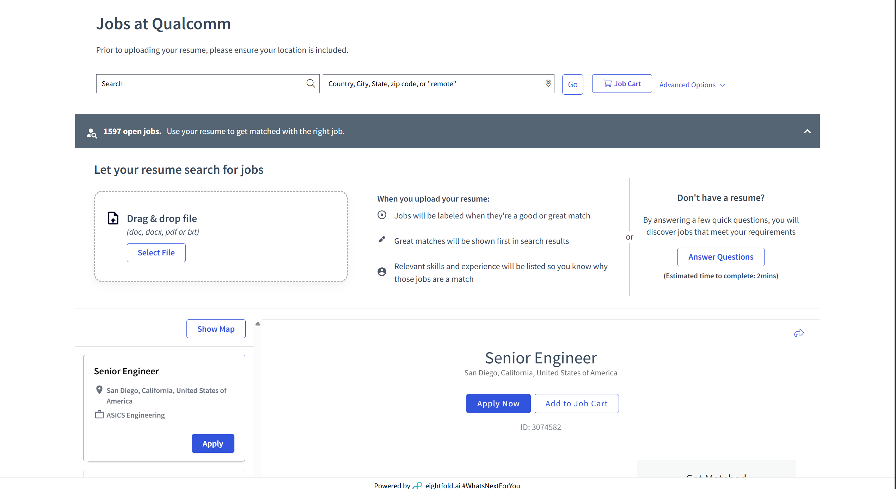
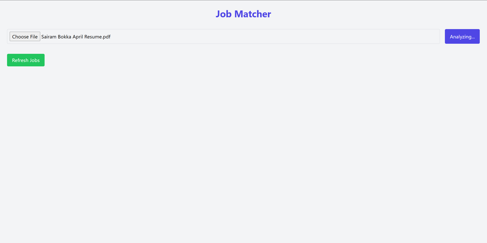
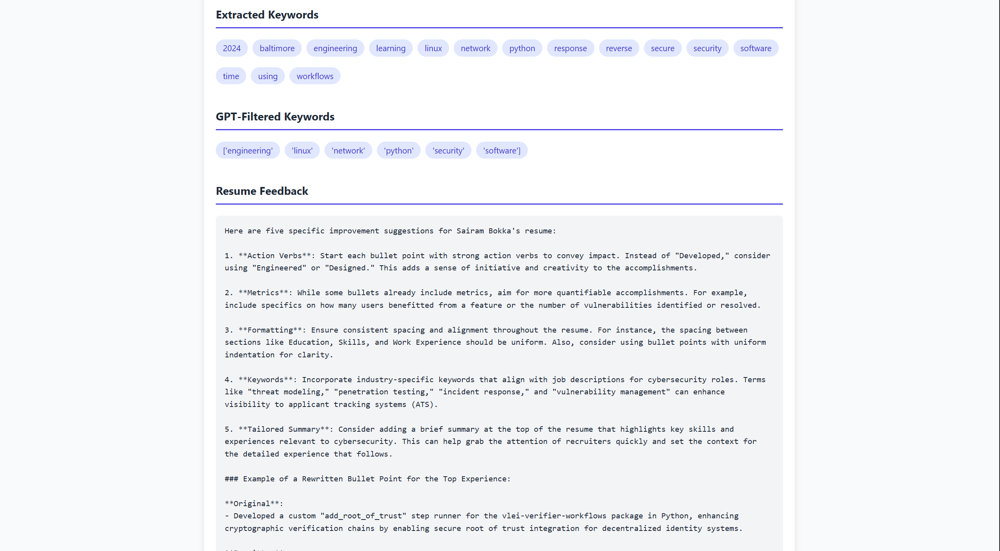
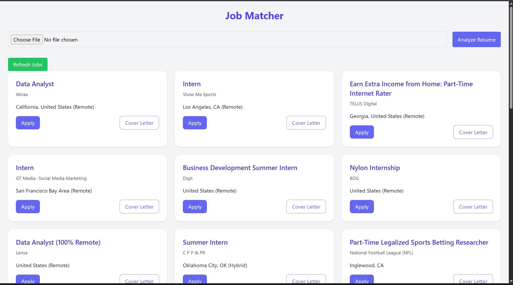
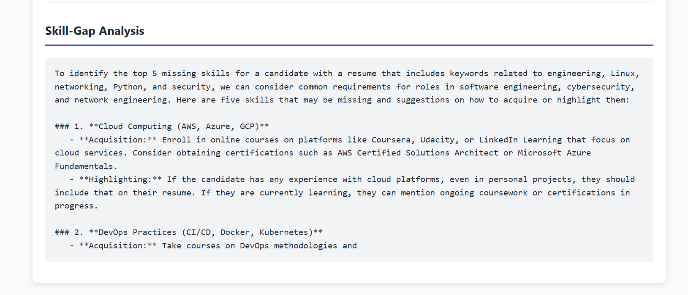
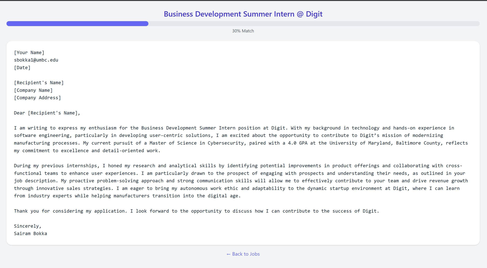

# ResumeMatch 🚀

[](LICENSE)  
[](https://www.python.org/downloads/)  
[](https://flask.palletsprojects.com/)  
[](https://openai.com/)

**Elevator Pitch**  
Job seekers spend hours tweaking their resumes and hunting for openings. ResumeMatch uses AI to instantly analyze and optimize your resume, match you to top roles, and even draft custom cover letters—saving you time and boosting your chances of landing interviews.

---

## 📋 Table of Contents

1. [Demo](#demo)  
2. [Features](#features)  
3. [Prerequisites](#prerequisites)  
4. [Installation](#installation)  
5. [Environment Variables](#environment-variables)  
6. [Usage](#usage)  
7. [Project Structure](#project-structure)  
8. [Built With](#built-with)  
9. [Roadmap](#roadmap)  
10. [Troubleshooting](#troubleshooting)  
11. [Contributing](#contributing)  
12. [License](#license)  
13. [Contact](#contact)  

---

## 🎬 Demo

### Video Demo
[](https://youtu.be/UQOcFqlfs4s?si=vMzaE_9ImK_R0kSb)  
*Click the image above to watch the full application demo on YouTube*

### Inspiration
  
_We saw how Qualcomm's portal instantly matches resumes to their roles and thought: let's bring that power to UMBC students and beyond._

_Screenshots:_

| Landing Page | Keywords & Feedback |
|:------------:|:-------------------:|
|  |  |

| Matched Jobs  | Skill Gap Analysis | Cover Letter |
|:-------------:|:------------------:|:-------------:|
|  |  |  |

---

## ✨ Features

- **Resume Analysis**: Extract text & keywords from PDF resumes  
- **AI‑Driven Feedback**: GPT‑powered suggestions on action verbs, metrics, formatting  
- **Job Matching**: Real LinkedIn job data via RapidAPI  
- **Skill‑Gap Analysis**: Highlights missing skills and offers learning paths  
- **Cover Letter Generation**: Tailored intros based on job description  
- **Match Scoring**: (Coming soon) Rank jobs by relevance  

---

## 🔧 Prerequisites

- Python **3.8+**  
- A free RapidAPI account with **LinkedIn Jobs API**  
- An **OpenAI** account & API key  

---

## 🛠️ Installation

```bash
# Clone
git clone https://github.com/sairambokka/resume-job-matcher.git
cd resume-job-matcher

# Setup venv
python -m venv venv
source venv/bin/activate    # macOS/Linux
venv\Scripts\activate       # Windows

# Install
pip install -r requirements.txt
```

## 🔑 Environment Variables

Create a `.env` file in the project root:

```ini
OPENAI_API_KEY=your_openai_api_key
RAPIDAPI_KEY=your_rapidapi_key
```

## 🚀 Usage

1. Start the server:
   ```bash
   python app.py
   ```

2. Visit `http://localhost:5000`

3. Upload your PDF resume

4. Explore:
   - Extracted skills
   - AI feedback
   - Matched jobs & cover letters
   - Skill‑gap analysis

## 📂 Project Structure

```
.
├── app.py                # Flask routes
├── resume_utils.py       # PDF parsing & keyword extraction
├── linkedin_api.py       # LinkedIn RapidAPI integration
├── gpt_utils.py          # OpenAI GPT helpers
├── templates/            # HTML views
│   ├── index.html
│   └── cover_letter.html
├── static/               # CSS & JS
├── assets/               # Screenshots & demo video
├── requirements.txt
├── README.md
└── LICENSE
```

## 🔨 Built With

- [Flask](https://flask.palletsprojects.com/) - Web framework
- [OpenAI GPT](https://openai.com/) - Natural language processing
- [PyMuPDF](https://pymupdf.readthedocs.io/) - PDF parsing
- [scikit-learn](https://scikit-learn.org/) - Machine learning utilities
- [RapidAPI](https://rapidapi.com/) - LinkedIn job data

## 🛣️ Roadmap

- [ ] Match scoring & ranking
- [ ] User authentication & profile saving
- [ ] Export improved resume (PDF)
- [ ] Automated tests & CI pipeline
- [ ] Docker containerization

## ❓ Troubleshooting

**Issue**: PDF parsing fails
**Solution**: Ensure your PDF is not password-protected and is in a readable format

**Issue**: No jobs appear after upload
**Solution**: Check your RapidAPI key and connection; try more general keywords

**Issue**: API rate limits
**Solution**: Implement caching or reduce the number of requests

## 🤝 Contributing

1. Fork the repo
2. Create a branch: `git checkout -b feature/name`
3. Commit: `git commit -m "Add feature"`
4. Push: `git push origin feature/name`
5. Open a PR — we'll review within 48 hours!

## 📜 License

Distributed under the MIT License. See [LICENSE](LICENSE) for details.

## 📬 Contact

Sairam Bokka – sbokka1@umbc.edu  
Project Link: [https://github.com/sairambokka/resume-job-matcher](https://github.com/sairambokka/resume-job-matcher)